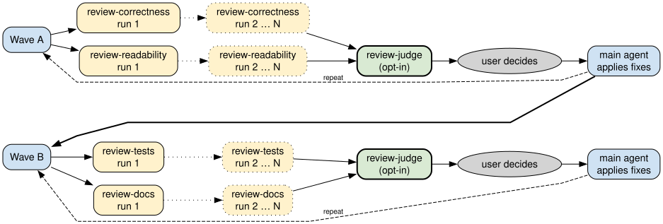

# Agent skills

Personal [coding agent skills](https://agentskills.io/).

---

**This repository contains personal tools that I publish for sharing, documentation and convenience.**

**They may or may not work for your use case, and little effort has been made to support systems and workflows other than the ones I use.**

---

## General

- Skills are agent-agnostic.
- Some skills start `pi` agent subprocesses for reviews, regardless of the main agent.
- Some skills hardcode the model used for reviews. I had the best results with OpenAI's GPT.

## Content

- [`handoff`](handoff/SKILL.md): Summarize the conversation into one self-contained document per divergent path.
- [`implem-brake`](implem-brake/SKILL.md): Forbid the agent from touching project files until explicitly allowed again, to discuss a change without it jumping to implementation. Invoked manually with `on`/`off`.
- [`review-auto-loop`](review-auto-loop/SKILL.md): Run waves of parallel chains of reviews with external reviewer agents, to balance thoroughness and speed. The user gets presented a report of all findings after each wave, opening on a summary of the reviewed change, each finding assessed by the main agent, and can choose which to apply.
- Per-domain review skills (called by the `review-auto-loop` skill):
  - [`review-correctness`](review-correctness/SKILL.md): Look for bugs, logic holes, incomplete changes, hidden quadratic complexity, etc.
  - [`review-readability`](review-readability/SKILL.md): Simplify code, use idiomatic patterns, counter model tendency to write overly verbose code.
  - [`review-tests`](review-tests/SKILL.md): Improve tests, find untested areas or useless tests.
  - [`review-docs`](review-docs/SKILL.md): Find docs or comments that are stale, missing, or breaking written conventions.
- [`review-judge`](review-judge/SKILL.md): Recommend an action on every item of a review wave (called by the `review-auto-loop` skill, opt-in).
- [`rust-project-maintenance`](rust-project-maintenance/SKILL.md): Run mechanical maintenance tasks for Rust projects, pausing for review after each change.
- [`settle-discussion`](settle-discussion/SKILL.md): Variant of the [`grill-me` skill](https://github.com/mattpocock/skills/blob/170ad48655825783d0193e850e31a9aac957bb95/skills/productivity/grilling/SKILL.md) that keeps the state of the discussion in a decision log file. Ideal for fleshing out an idea into a spec.
- [`summarize-change`](summarize-change/SKILL.md): Describe the changes of a revision as high level prose (called by the `review-auto-loop` skill).
- [`wait-what`](wait-what/SKILL.md): Ask for the last message to be pitched again in plain English, to counter the cryptic and overly compressed language Opus 5 tends to use. Variant of the [`wait-what` skill](https://github.com/mattpocock/skills/blob/50777fcc0982d5867997a75a1e0731b9daac94eb/skills/productivity/wait-what/SKILL.md).

## Review workflow

`review-auto-loop` drives the other review skills as one pipeline. A wave runs one phase, each domain as a chain of runs: phase A chains `review-correctness` and `review-readability`, phase B chains `review-tests` and `review-docs`. The split keeps the domains that change production code apart from those that follow it, so tests and docs are never reviewed against code a correctness fix from the same wave may still move. Within a chain, each run reads the captures of the runs before it and only raises new items, until a run finds none or the chain reaches its cap. `summarize-change` runs alongside the chains, and its prose opens the wave report.

Once the main agent has assessed every item of a wave, `review-judge`, when opted in, recommends an action on each. It does not review again: it takes the assessment as settled and rules on the course of action, with encoded priorities — whether the fix goes far enough, whether the defect can be reached, fewer lines in production code and more coverage in tests when two courses tie — and arguments like "the linter would warn" or "a test pins this behaviour" never settle a call on their own.

The user keeps the final say: the recommendation is only each item's default, and they pick item by item. The main agent applies the picks, the user squashes them, then chooses to repeat the wave's domains or move to the other phase. Every default can be overridden along the way: the domains a wave runs, the cap of each chain, and whether a wave is judged at all.

## License

[MIT](LICENSE).
